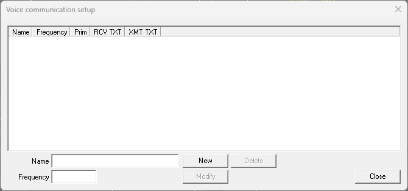
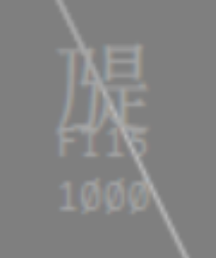
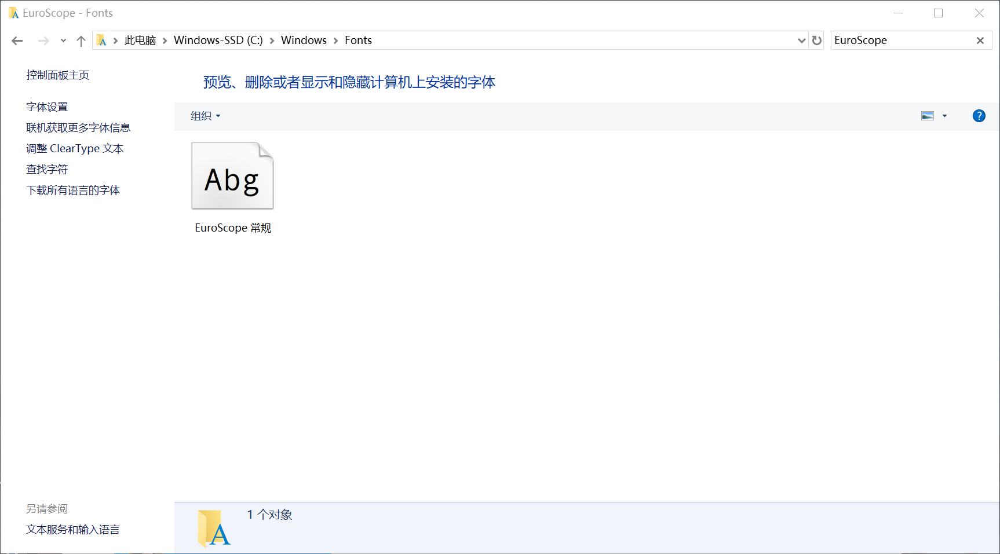
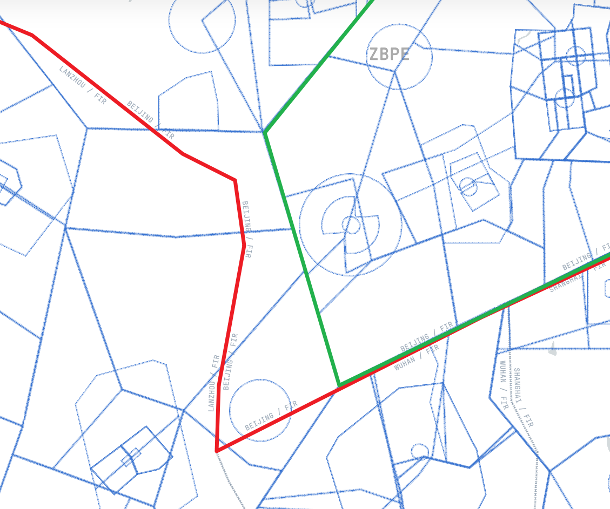

# Flyatcsim 扇区问答

Flyatcsim Sector FAQ

## 关于版权方面

Q: 扇区是不是我买了之后就可以发给别人和我一个**合租**？

A: 否定的。根据《Flyatcsim Sector LICENSE》有关规定：`	分发：用户不得在非空管模拟机交流群（QQ群：949076443）内发布或向其他用户分发本扇区。若用户将包含上述临时文件的扇区发送给其他人，则视为二次创作并分发。`

既，您不得将购买完毕的扇区再次发给您的任何朋友。

> [!IMPORTANT]
>
> 请注意：任何使用扇区用户必须有一人一次面包多购买记录。

---

Q: 如果我改了扇区的一部分内容（比如配色），那我能不能把修改好的配色再次分发给朋友呢？

A: 否定的。与上条回答相同，您不得将此扇区更改并分发。

## 关于使用方面

Q: 我打不开扇区怎么办？

A: 您应首先检查您是否安装了以下运行库：

- https://aka.ms/vs/17/release/vc_redist.x86.exe
- https://www.microsoft.com/en-us/download/details.aspx?id=35

其次，您应排查您的EuroScope是否为经修改的版本或低于v3.2.9，下载EuroScope请至：https://www.euroscope.hu/wp/category/public-release/

最后，如果您还是无法打开扇区，请至订阅者群里中寻找我们的帮助（面包多中有群入口）

---

Q: 我如果遇到了下图的现象，我该如何解决呢？

A: 下图就是典型的EuroScope低于v3.2.9时，会出现的问题，由于我们无法同时适配v3.2.9+和v3.2.9-，我们选择适配v3.2.9+的方案。因此，您必须使用v3.2.9+的EuroScope版本。

---

Q: 我的扇区显示的是“乃是”，这个现象是对的吗？

A: 否定的。此现象由于字体未安装导致，您可以跟随以下步骤安装字体：

- 进入 `C:\Windows\Fonts` 文件夹，搜素"EuroScope"

  

  > [!NOTE]
  >
  > 这时，可能有多个EuroScope字体都成为"EuroScope"，请您将其全部删除

- 在扇区根目录处，有一个 `Euroscope.ttf` 的文件，双击进行安装

---

Q: 我的扇区为什么听到一阵电话的时候后就崩溃了？ 或者我点VCCS就奔溃了？

A: 得益于EuroScope的**特性**，您不得不使用v3.2.10版本使用VCCS。即，如果您听到电话声就奔溃了，那极度可能是别人给你打VCCS，但你的EuroScope低于3.2.10，导致您的EuroScope奔溃。

---

Q: 我的飞机标牌高度显示`Aauu↓`，怎么解决？

A: 需安装字体，安装上述步骤安装，这里不再赘述。

---

Q: 计划检查中的`PBN`、`ACEQ`、`TYPE`是什么意思？我看起来计划没有什么问题？

A: `PBN`、`ACEQ`是机组没有正确填写PBN和设备码，可在此查询：https://www.bilibili.com/opus/1005350469903581188；通用PBN码：`PBN/A1B1C1D1L1O2S2`

而`TYPE`，则是机组的机型不正确，有以下两种可能性：

- 由于机型中多了`/X`导致，应删除`/X`改为`/L`或无RVSM、GNSS、应答机mode C
- 机型不正确，可在此查询：https://www2023.icao.int/publications/doc8643/pages/search.aspx

---

Q: 我搜索不到机场的气象是不是扇区的问题？

A: 否定的。自EuroScope v3.2.9起，EuroScope的报文源由服务器提供转为Vatsim官方源，如果您的报文显示过期/无，可以前往大群的QQ群机器人问询。

---

Q: 以ZBYC机场为例，为什么他属于ZBPE情报区内的，但是是在 `ZLHW.prf` 里面的？

A: 由于中国大陆的FIR和管制区是没有任何关系的，扇区 `ZBPE.prf` 实际上的管制空域如下图绿线**内侧**所示，扇区 `ZLHW.prf` 为绿线**外侧**（部分区域），而红线则代表着真实的FIR边界。

因此，ZBPE_CTR实际上的范围为绿线**内侧**，ZLHW_CTR为绿线**外侧**（部分区域），此处的ZBPE和ZLHW字母并不代表着FIR编号，而是合扇编号。

而ZBYC机场恰巧在绿和红线之间，如想要管此机场，则需要在`ZLHW.prf` 中，才能看见并管制；真实情况下，ZLHW_CTR是管制ZBYC机场的CTR空域的（绿线**外侧**所示）。

## The end.

如果您有任何问题，您可以在订阅者群里中寻找我们的帮助（面包多中有群入口）